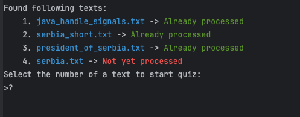
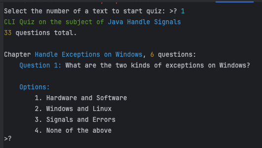
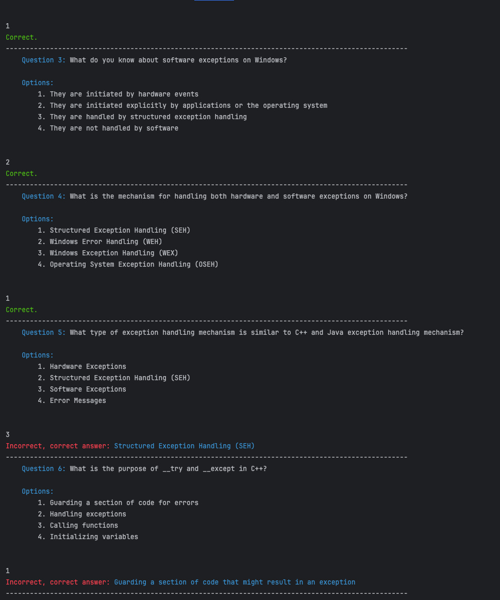
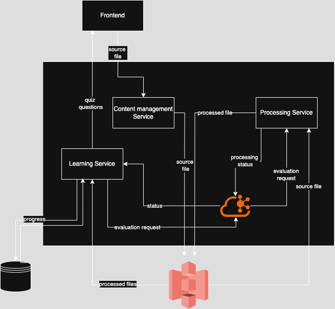

# Quizzer

## About

### Quiz generation from arbitrary texts (potentially from video and audio as well)

### Tested approaches:
#### Split - RAG Summarize - Generate - Enrich

1. **Split** - split the text into chapters
2. **Summarize** - summarize with BERT and extract references with RAG
3. **Question-answer Generation** - generate a number of question-answer pairs for each chapter using the extracts
4. **Question Enrichment** - Add incorrect options for each previously generated question

#### Split - Summarize - Generate

1. **Split** - split the text into chapters
2. **Key Points** - extract most important points from each chapter
3. **Question** - generation of questions for each key point

#### Split - Generate - Enrich
1. **Split** - split the text into chapters
2. **Question-answer Generation** - generate a number of question-answer pairs for each chapter
3. **Question Enrichment** - Add incorrect options for each previously generated question

Orchestrated by langgraph

### Layers implementations:
**Split** 
   1. Regex parser - **default**, later to be improved with cosine similarities from spaCy
   2. LLM prompting - straightforward, but super expensive for such a task

**Key Points**
   1. LLM Prompting - expensive - need to feed the entire text to LLM. Potential context window issues
   2. BERT + RAG - faster, cheaper, but based on the word frequency 

**Question** - LLM prompting

**Question-answer Generation** - LLM prompting

**Question Enrichment** - LLM prompting

#### LLMs to use: local LLaMa or OpenAI, see [llm-conf.toml](src/poc_python/config/stages.toml)

## Setup with LLaMa
1. Download the sourcecode of the repo
2. install llama_cpp (requires compiling cpp lib first)
3. download an LLM .gguf file and specify the path in [llms.toml](src/poc_python/config/stages.toml) in __model_path__ vars
4. add source texts to <project_root>/sample_inputs (only plain text is supported yet)

## Setup with OpenAI
1. Download the sourcecode of the repo
2. Get the OpenAI API key and set it to OPENAI_API_KEY environment variable
3. add source texts to <project_root>/sample_inputs (only plain text is supported yet)

## Run
### When started, it prompts you to select a text from sample_inputs 
### and checks whether it was already processed (is in cache from joblib.memory)

### The quiz starts with its chapters:

### The quiz was generated with LlaMA 8B which means any cloud based model with sufficient number of parameters would perform way better

## Problems
### Sometimes the LLM generates gibberish even though JSON grammar is specified for the output
#### For now those questions are skipped as errors occur while parsing them
### Paraphrasing is still a problem to be solved (see question 6):

## Planned Architecture

