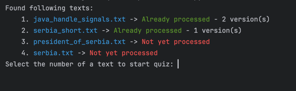

# Quizzer

## About

### Quiz generation from arbitrary texts (potentially from video and audio as well)

### Currently consists of three layers:

1. **Markup** - split the text into chapter
2. **Key Points** - extract most important points from each chapter
3. **Question** - generation of questions

### Layers are currently implemented as:
1. **Markup** 
   1. Regex parser - **default**, later to be improved with cosine similarities from spaCy
   2. LLM prompting - straightforward, but super expensive for such a task
2. **Key Points** - LLM prompting
3. **Question** - LLM prompting

#### Currently used LLM is a local LlaMA specified in [llms.toml](src/poc_python/config/llms.toml)

## Setup
1. Download the sourcecode of the repo
2. install llama_cpp (requires compiling cpp lib first)
3. download an LLM .gguf file and specify the path in [llms.toml](src/poc_python/config/llms.toml) in __model_path__ vars
4. add source texts to <project_root>/sample_inputs (only plain text is supported yet)

## Run
### When started, it prompts you to select a text from sample_inputs 
### and checks whether it was already processed (is in cache from joblib.memory)

### The quiz starts with its chapters:

### The quiz was generated with LlaMA 8B which means any cloud based model with sufficient number of parameters would perform way better

## Problems
### Sometimes the LLM generates gibberish even though JSON grammar is specified for the output
#### For now those questions are skipped as errors occur while parsing them
### Paraphrasing is still a problem to be solved (see question 6):

### Performance is problematic on personal devices
### Quality and correctness of questions is yet to be checked, but even LlaMA 8B does a relatively good job